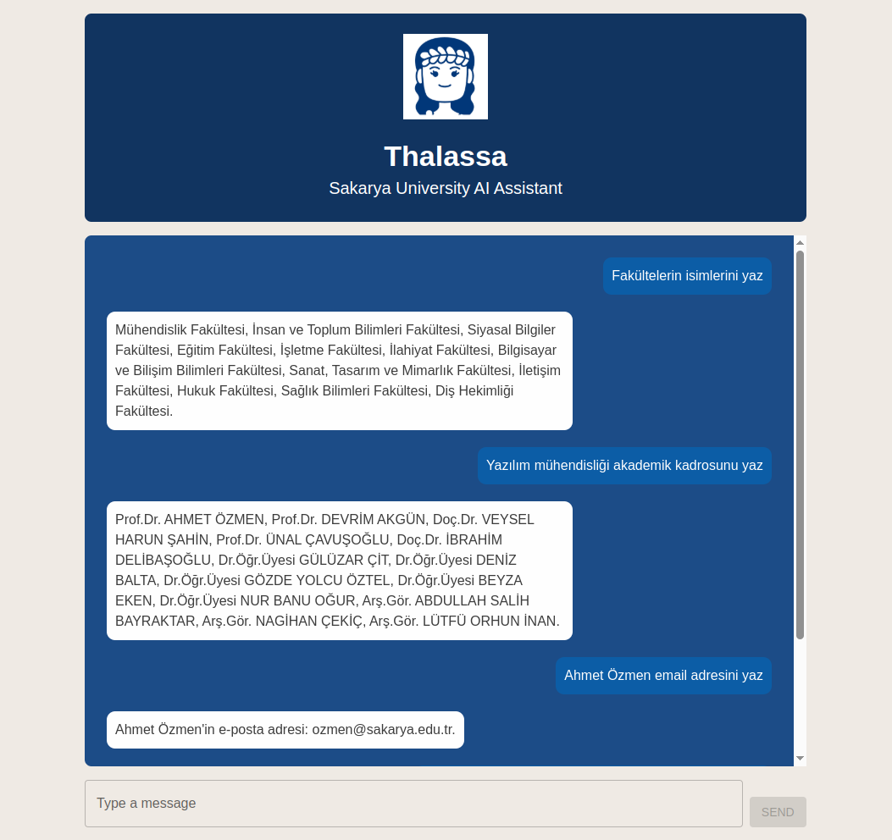
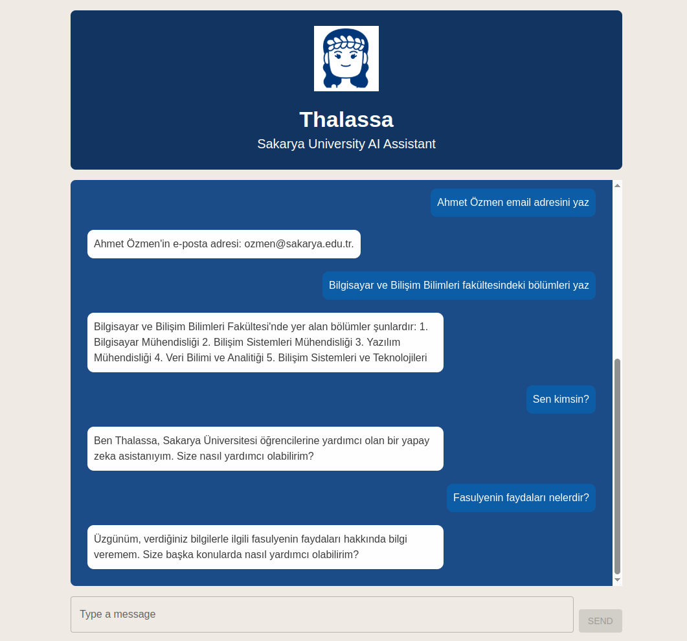

# Thalassa - Sakarya University AI Assistant (OpenAI version)

Thalassa is an AI-powered chatbot designed to assist Sakarya University students. It uses a **Turkish data store** and leverages Retrieval-Augmented Generation (RAG) with the **OpenAI API**. The system employs **multilingual models** for embedding and context re-ranking, conversational memory, and date awareness to provide accurate, contextually relevant, and natural-sounding responses in the user's language (Turkish/English).

## Screenshots




## Overview (Multilingual Component Pipeline)

This version works directly with Turkish source documents and utilizes specialized multilingual components for improved cross-lingual understanding:

1.  **Data Preparation (Offline):** Original Turkish `.txt` documents reside in the `extracted_texts/` folder.
2.  **Indexing (Offline):** `reload.sh` merges the Turkish texts and builds a FAISS index using embeddings from a **multilingual sentence transformer** (`paraphrase-multilingual-mpnet-base-v2` by default) generated from the **Turkish text**.
3.  **Session Management:** Frontend manages a `session_id` for conversational context.
4.  **Language Detection:** Backend detects the user's query language (TR/EN).
5.  **Query Translation (for Search/Rank):** Non-English queries are translated to English (via MyMemory API) to serve as a stable anchor for cross-lingual retrieval and ranking.
6.  **Context Retrieval (FAISS):** The **English query embedding** searches the FAISS index (containing **Turkish text embeddings**) to retrieve initial candidates (cross-lingual search).
7.  **Context Re-ranking (Cross-Encoder):** A **multilingual Cross-Encoder** (`cross-encoder/mmarco-mMiniLMv2-L12-H384-v1` by default) re-ranks the retrieved **Turkish chunks** based on relevance to the **English query**.
8.  **Final Context Selection:** The top `FINAL_CONTEXT_K` **Turkish chunks** are selected.
9.  **Conversation History & Date:** Recent history (in-memory) and current date are retrieved.
10. **Prompt Construction:** A detailed prompt is sent to OpenAI including system instructions, few-shot examples, current date, the retrieved **Turkish context**, conversation history, and the **original user query**.
11. **OpenAI API Call:** The prompt instructs the LLM (e.g., GPT-3.5/4) to generate an answer in the **same language as the original query**, understanding the Turkish context.
12. **History Update & Response:** The interaction is stored, and the final answer (in the user's language) and `session_id` are sent to the frontend.

## Key Features

- **Works with Turkish Source Data:** Directly indexes and retrieves from Turkish documents.
- **Multilingual RAG Components:** Uses multilingual embedding and cross-encoder models for better cross-lingual understanding.
- **Leverages OpenAI Models:** Uses models like GPT-3.5 Turbo or GPT-4 via API for generation.
- **Conversational Memory:** Remembers recent interactions per session using session IDs.
- **Date Awareness:** Prioritizes upcoming dates and handles past dates intelligently.
- **Accurate Language Handling:** Understands Turkish/English queries, responds in the user's original language.
- **Few-Shot Prompting:** Guides LLM behavior with examples for complex tasks.
- **User-Friendly Interface:** React-based chat interface with MUI components.
- **Asynchronous Backend:** Efficient request handling with FastAPI.

## Technology Stack

- **Backend:**
  - Python 3.x
  - FastAPI
  - OpenAI Python Library
  - Sentence Transformers (for embedding & cross-encoder models)
  - FAISS (CPU/GPU)
  - Langdetect
  - Requests (for MyMemory API)
  - Numpy
  - Uvicorn
  - python-dotenv
- **Frontend:**
  - React
  - JavaScript
  - Material UI (MUI)
  - Axios
  - React Spinners
  - Lodash.debounce
- **AI Models:**
  - Generation: OpenAI (GPT-3.5 Turbo, GPT-4, etc. - configurable)
  - Embedding: `paraphrase-multilingual-mpnet-base-v2` (Multilingual - configurable)
  - Re-ranking: `cross-encoder/mmarco-mMiniLMv2-L12-H384-v1` (Multilingual - configurable)
- **Vector Store:** FAISS
- **Translation Service (Query):** MyMemory API

## Setup and Installation

1.  **Clone Repository:**

    ```bash
    git clone <your-repository-url>
    cd <repository-directory>/backend # Navigate to backend first
    ```

2.  **Ensure Turkish Data:** Place your original Turkish `.txt` files in the `backend/extracted_texts/` directory (or configure `TEXT_FOLDER` in `.env`).

3.  **Get OpenAI API Key:** Obtain an API key from [https://openai.com/](https://openai.com/).

4.  **Backend Setup:**

    - Create and activate a Python virtual environment:
      ```bash
      python -m venv venv
      source venv/bin/activate  # On Windows: venv\Scripts\activate
      ```
    - Install Python dependencies:
      ```bash
      pip install -r requirements.txt
      ```
    - Create a `.env` file (likely in `backend/` or root, see Project Structure). Configure it:

      ```env
      OPENAI_API_KEY="your_openai_api_key_here"

      # --- Ensure TEXT_FOLDER points to your Turkish data ---
      TEXT_FOLDER="extracted_texts"

      # --- Specify Multilingual Models ---
      EMBEDDING_MODEL="paraphrase-multilingual-mpnet-base-v2"
      CROSS_ENCODER_MODEL="cross-encoder/mmarco-mMiniLMv2-L12-H384-v1"

      # Optional: Adjust RAG/History parameters
      # OPENAI_MODEL="gpt-3.5-turbo"
      # FAISS_RETRIEVAL_K=10
      # FINAL_CONTEXT_K=4
      # MAX_HISTORY_TURNS=3
      ```

    - **IMPORTANT:** Build the FAISS index from the Turkish data:
      ```bash
      bash reload.sh # Run from the directory containing the script
      ```

5.  **Frontend Setup:**
    - Navigate to the frontend directory:
      ```bash
      cd ../frontend # Adjust path relative to where you ran backend setup
      ```
    - Install Node.js dependencies:
      ```bash
      npm install
      # or
      # yarn install
      ```

## Usage

1.  **Start Backend:**

    - Navigate to the directory containing `run.sh` (likely `backend/`).
    - Activate virtual environment (`source venv/bin/activate`).
    - Ensure `.env` is configured and accessible.
    - Run the backend server:
      ```bash
      bash run.sh
      ```

2.  **Start Frontend:**

    - Open a **new terminal**.
    - Navigate to the `frontend/` directory.
    - Start the React development server:
      ```bash
      npm start
      # or
      # yarn start
      ```

3.  **Interact:** Open your web browser and navigate to `http://localhost:3000` (or the port specified by the React server).

## Scripts

- **`run.sh`:** Activates venv and starts the FastAPI backend server.
- **`reload.sh`:** Deletes old index/metadata, merges texts in `TEXT_FOLDER`, and builds a new FAISS index using the `EMBEDDING_MODEL`. Run after changing text files or `EMBEDDING_MODEL`.

## Configuration (`.env` file - location depends on script execution path)

- `OPENAI_API_KEY`: **(Required)** OpenAI API key.
- `TEXT_FOLDER`: **(Required)** Path to **Turkish** source `.txt` files (default: `extracted_texts`).
- `OPENAI_MODEL`: (Optional) OpenAI generation model (default: "gpt-3.5-turbo").
- `EMBEDDING_MODEL`: (Optional) Multilingual Sentence Transformer for indexing (default: "paraphrase-multilingual-mpnet-base-v2").
- `CROSS_ENCODER_MODEL`: (Optional) **Multilingual** Cross-encoder for re-ranking (default: "cross-encoder/mmarco-mMiniLMv2-L12-H384-v1").
- `FAISS_RETRIEVAL_K`: (Optional) Initial candidates from FAISS (default: 10).
- `FINAL_CONTEXT_K`: (Optional) Chunks sent to LLM after re-ranking (default: 4).
- `MAX_HISTORY_TURNS`: (Optional) Conversation history length (default: 3 pairs).

## Workflow Summary

User Input (TR/EN) -> Frontend -> Backend API -> Detect Lang -> Translate Query to EN -> Search FAISS (TR Index) w/ EN Embedding -> Retrieve TR Chunks -> Re-rank (EN Query, TR Chunks) w/ Multilingual Cross-Encoder -> Select Top TR Chunks -> Get History & Date -> Construct Prompt (TR Context, Original Query, History, Date) -> Call OpenAI -> Get Response (User's Lang) -> Update History -> Send Response to Frontend -> Display

## Limitations & Future Improvements

- **Cross-Lingual RAG Performance:** May still be slightly less precise than fully monolingual RAG in some edge cases.
- **In-Memory History:** Lost on server restart. Use a database (Redis, etc.) for persistence in production.
- **Translation API Limits:** MyMemory has limits; consider alternatives for heavy use.
- **Scalability:** Demo setup. Production needs proper deployment (workers, containers).
- **Context Window Limits:** Very long conversations could exceed token limits. Consider history summarization.
- **Framework Adoption:** Explore LangChain/LlamaIndex for managing more complex RAG pipelines.
